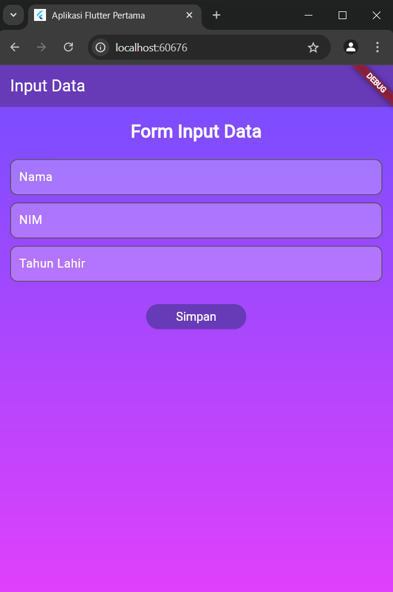
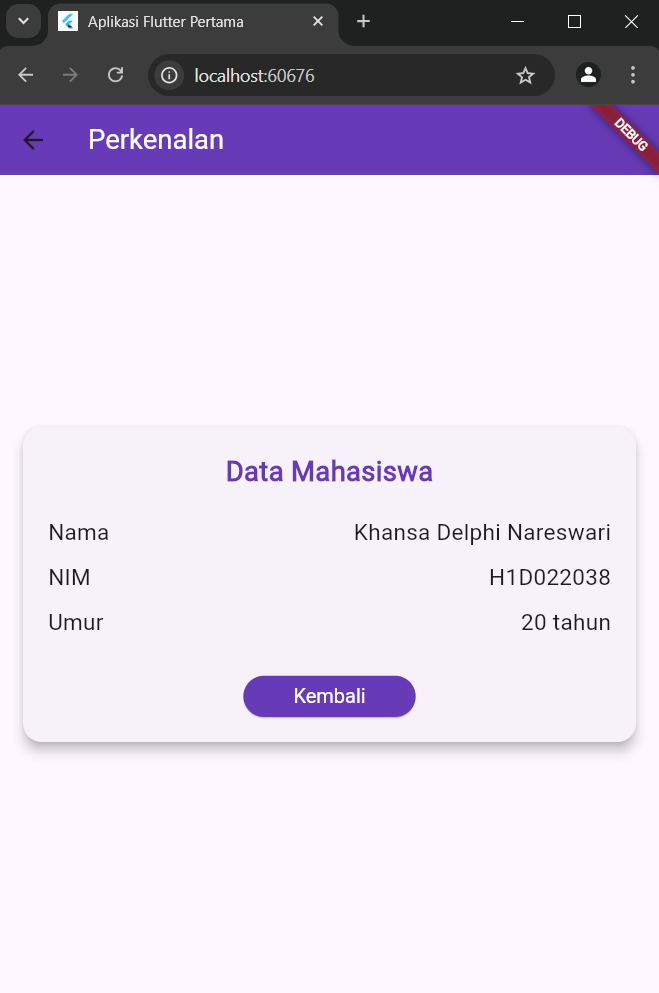

# Tugas Pertemuan 2

Fork dan clone repository ini, lalu jalankan perintah 
```
flutter pub get
```
Buatlah tampilan form yang berisi nama, nim, dan tahun lahir pada file `ui/form_data.dart`, lalu buatlah tampilan hasil dari input data tersebut pada file `ui/tampil_data.dart`

JELASKAN PROSES PASSING DATA DARI FORM MENUJU TAMPILAN DENGAN FILE `README.md`
Pengguna melakukan input data, setelah itu input dari pengguna akan disimpan dalam TextEditingController pada file form_data. Ketika tombol simpan di klik, data dari TextEditingController akan diambil menggunakan properti .text. Selain itu, navigator juga digunakan untuk pindah dari halaman form ke halaman hasil ketika tombol simpan di klik. Data yang diambil dari form dikirimkan ke halaman tampilan melalui constructor di TampilData. Setelah itu pada file tampil_data, data yang dikirim dari file form_data diterima melalui constructor di dalam class TampilData. Setelah itu data ditampilkan.

Buat tampilan semenarik mungkin untuk dilihat.


Nama : Khansa Delphi Nareswari

NIM : H1D022038

Shift Baru: B

## Screenshot
Contoh :


